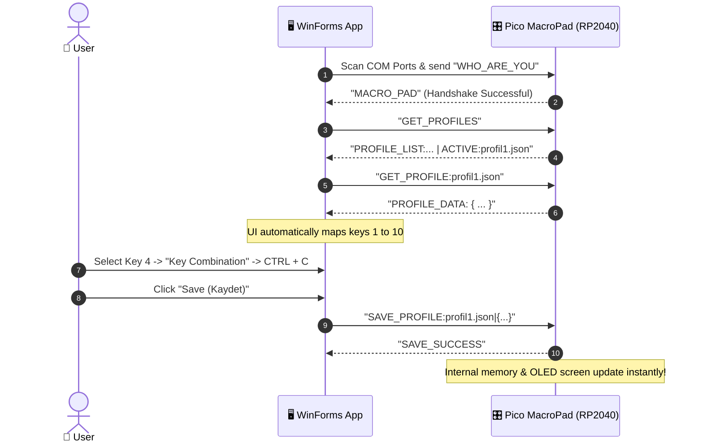

# 🎛️ Felix MacroPad (RP2040 / Raspberry Pi Pico)


**Felix MacroPad** is an open-source, modular, and programmable physical macro keypad powered by **Raspberry Pi Pico (RP2040)** and **CircuitPython**. Equipped with 10 mechanical keys, 10 addressable WS2812B RGB NeoPixels, a 128x64 I2C SSD1306 OLED display, and an EC11 Rotary Encoder, it offers both on-device configuration and seamless PC control via a dedicated **C# .NET Windows Management App**.

---

## 🌟 Key Features

- ⌨️ **10 Independent Macro Keys:** Assign complex shortcut combinations (`Ctrl+C`, `Win+D`, `Alt+Tab`, `Ctrl+Shift+Esc`), media keys, or text strings.
- 🔤 **String Typing & Layout Support:** Instant typing of text strings, passwords, or snippets via `STRING:` prefix with Turkish Q and international layout compatibility.
- 📺 **0.96" 128x64 SSD1306 OLED Screen:** Displays active profile, lighting effects, brightness levels, device status, and interactive on-device menus.
- 🎚️ **Rotary Encoder (EC11):** Smooth navigation through menus, profiles, brightness adjustments, and press-to-confirm action.
- 🌈 **WS2812B NeoPixel RGB Lighting:** Per-key backlighting, startup ripple animations, status indicators, and customizable color modes (Blue, Red, Green, White).
- ⚙️ **On-Device Management Mode (OS Menu):** Enter the built-in device menu (`GP0 + GP1 + GP2` or Encoder) to switch profiles, adjust display contrast, change LED colors, and toggle sleep mode—no PC software needed!
- 🖥️ **Windows Desktop GUI (.NET WinForms):**
  - Automatic Serial COM port detection and handshaking (`WHO_ARE_YOU` ➔ `MACRO_PAD`).
  - Real-time profile creator, editor, deleter, and renamer.
  - Interactive visual button mapper.
  - Windows System Tray integration.
- 🔒 **Smart Storage Management (`boot.py`):** Normal boot disables USB flash drive presentation, enabling CircuitPython to write settings to internal storage. Holding **Key 1 (GP0)** during USB plugin forces USB Drive mode for firmware/code editing.

---

## 🔌 Hardware Wiring & Pinout Diagram

### 📊 Visual Wiring Diagram (Mermaid)

```mermaid
flowchart TD
    subgraph PICO["Raspberry Pi Pico (RP2040)"]
        direction TB
        GP0["GP0 (Pin 1)"]
        GP1["GP1 (Pin 2)"]
        GP2["GP2 (Pin 4)"]
        GP3["GP3 (Pin 5)"]
        GP4["GP4 (Pin 6)"]
        GP5["GP5 (Pin 7)"]
        GP6["GP6 (Pin 9)"]
        GP7["GP7 (Pin 10)"]
        GP8["GP8 (Pin 11)"]
        GP9["GP9 (Pin 12)"]
        GP10["GP10 (Pin 14)"]
        GP15["GP15 (Pin 20)"]
        GP26["GP26 (Pin 31)"]
        GP27["GP27 (Pin 32)"]
        GP28["GP28 (Pin 34)"]
        GP29["GP29 (Pin 35)"]
        V33["3V3 OUT (Pin 36)"]
        GND["GND (Pins 3,8,13,18,23,28,33,38)"]
    end

    subgraph KEYS["10x Mechanical Switches"]
        K1["Key 1 (SW1)"] --- GP0
        K2["Key 2 (SW2)"] --- GP1
        K3["Key 3 (SW3)"] --- GP2
        K4["Key 4 (SW4)"] --- GP3
        K5["Key 5 (SW5)"] --- GP4
        K6["Key 6 (SW6)"] --- GP5
        K7["Key 7 (SW7)"] --- GP6
        K8["Key 8 (SW8)"] --- GP7
        K9["Key 9 (SW9)"] --- GP8
        K10["Key 10 (SW10)"] --- GP9
        K_GND["Common Ground Rail"] --- GND
    end

    subgraph OLED["128x64 SSD1306 OLED (I2C)"]
        O_SDA["SDA"] --- GP28
        O_SCL["SCL"] --- GP29
        O_VCC["VCC"] --- V33
        O_GND["GND"] --- GND
    end

    subgraph ENCODER["Rotary Encoder (EC11)"]
        E_A["CLK / A"] --- GP27
        E_B["DT / B"] --- GP26
        E_SW["SW (Push Button)"] --- GP15
        E_VCC["+ / VCC"] --- V33
        E_GND["GND"] --- GND
    end

    subgraph LEDS["WS2812B NeoPixel RGB Strip (10 LEDs)"]
        L_DIN["DIN (Data In)"] --- GP10
        L_VCC["5V / VBUS (or 3V3)"] --- V33
        L_GND["GND"] --- GND
    end

    classDef picoStyle fill:#c51a4a,stroke:#333,stroke-width:2px,color:#fff;
    classDef compStyle fill:#1e293b,stroke:#0284c7,stroke-width:2px,color:#f8fafc;
    class PICO picoStyle;
    class KEYS,OLED,ENCODER,LEDS compStyle;
```



---

### 📌 Pinout & Connection Reference Table

| Module / Component | Component Pin | Pico GPIO Pin | Physical Pin # | Notes |
| :--- | :--- | :--- | :--- | :--- |
| **Key 1 (SW1)** | Pin 1 | **GP0** | Pin 1 | Internal Pull-Up (Connect other pin to GND) / Safe Disk Boot Key |
| **Key 2 (SW2)** | Pin 1 | **GP1** | Pin 2 | Internal Pull-Up (Connect other pin to GND) |
| **Key 3 (SW3)** | Pin 1 | **GP2** | Pin 4 | Internal Pull-Up (Connect other pin to GND) |
| **Key 4 (SW4)** | Pin 1 | **GP3** | Pin 5 | Internal Pull-Up (Connect other pin to GND) |
| **Key 5 (SW5)** | Pin 1 | **GP4** | Pin 6 | Internal Pull-Up (Connect other pin to GND) |
| **Key 6 (SW6)** | Pin 1 | **GP5** | Pin 7 | Internal Pull-Up (Connect other pin to GND) |
| **Key 7 (SW7)** | Pin 1 | **GP6** | Pin 9 | Internal Pull-Up (Connect other pin to GND) |
| **Key 8 (SW8)** | Pin 1 | **GP7** | Pin 10 | Internal Pull-Up (Connect other pin to GND) |
| **Key 9 (SW9)** | Pin 1 | **GP8** | Pin 11 | Internal Pull-Up (Connect other pin to GND) |
| **Key 10 (SW10)**| Pin 1 | **GP9** | Pin 12 | Internal Pull-Up (Connect other pin to GND) |
| **NeoPixel LEDs**| DIN | **GP10** | Pin 14 | 10x WS2812B in Series |
| **Encoder Button**| SW | **GP15** | Pin 20 | Encoder Push Switch (Pull-Up) |
| **Encoder Data** | DT (B) | **GP26** | Pin 31 | Rotary Encoder Direction Pin |
| **Encoder Clock**| CLK (A) | **GP27** | Pin 32 | Rotary Encoder Phase Pin |
| **OLED SDA** | SDA | **GP28** | Pin 34 | I2C Data Line |
| **OLED SCL** | SCL | **GP29** | Pin 35 | I2C Clock Line |
| **Power (VCC)** | VCC / VDD | **3V3 OUT** / **VBUS** | Pin 36 (3V3) / Pin 40 (5V) | 3.3V power for OLED, Encoder, Keys |
| **Ground** | GND | **GND** | Pins 3, 8, 13, 18, 23, 28, 38 | Common Ground |

---

## 🖥️ Windows Management App (.NET WinForms) User Guide

The companion C# .NET desktop application provides an intuitive graphical interface to configure macros, manage multiple profiles, and sync with the MacroPad over USB Serial in real time.



### 1. Automatic Auto-Connect
- When the app launches, a loading splash screen appears.
- It scans all COM ports asynchronously and sends `WHO_ARE_YOU`. Once the Pico responds with `MACRO_PAD`, the connection is established automatically without requiring manual port selection.

### 2. Assigning Actions to Keys
1. **Select a Key:** Click any of the 10 visual buttons on the UI (`Key 1` to `Key 10`).
2. **Choose Function Type:**
   - **Key Combination:** Check modifiers (`CTRL`, `ALT`, `SHIFT`, `WIN`) and enter target keys in the text box (e.g., `C`, `V`, `TAB`, `ESC`, `F5`).
   - **String:** Type text/passwords to be typed out automatically via `STRING:text` (supports Turkish and international characters).
   - **Media & Navigation:** Select predefined commands from dropdown: `Play/Pause`, `Next/Previous Track`, `Mute`, `Volume Up/Down`, `Enter`, `Esc`, `Tab`, `Arrows`, `PageUp/Down`, `Delete`, `Insert`.
   - **Not Active:** Disables the button.
3. **Save:** Click the **Save** button to write changes directly to the Pico's flash storage.

### 3. Profile Management
- **Switch Profiles:** Select any profile from the dropdown list to load its configuration.
- **Create New Profile:** Click `+ New Profile` to create a fresh JSON template.
- **Manage Profiles:** Click `Manage Profiles` to rename or delete existing profiles on the device.

### 4. System Tray Integration
- Minimizing or closing the window sends the application to the **Windows System Tray**, ensuring lightweight background availability.

---

## 🎮 On-Device OS Menu Navigation

You can configure and use the MacroPad completely standalone:

- **Enter Management Mode:** Press **Key 1 + Key 2 + Key 3** (`GP0 + GP1 + GP2`) simultaneously. The LEDs will blink red to indicate management mode.
- **Menu Navigation:** Rotate the **Rotary Encoder** or press **Key 1** (Left) / **Key 2** (Right).
- **Select / Confirm:** Press the **Rotary Encoder Push Button** or **Key 3** (OK).
- **Menu Items:**
  - 📁 **PROFILES:** Browse and switch between saved JSON profiles on the flash memory.
  - 💡 **LIGHTS:** Toggle LEDs ON/OFF, switch color modes (Blue, Red, Green, White), and adjust LED brightness.
  - ⚙️ **SETTINGS:** Adjust OLED contrast/brightness, toggle auto sleep mode (30s timeout), and toggle header text.

---

## 📂 Project Structure

```plaintext
macropad/
├── README.md                 # Project documentation & wiring guide
├── .gitignore                # Git ignore rules for .NET & CircuitPython
│
├── macro_pad_os/             # CircuitPython firmware & OS for Raspberry Pi Pico
│   ├── boot.py               # Storage & USB drive permission manager
│   ├── code.py               # Main OS, HID engine, OLED & LED controller
│   ├── font5x8.bin           # Display bitmap font
│   ├── settings.json         # Persistent device settings
│   ├── profil1.json          # Default profile template
│   └── lib/                  # CircuitPython libraries (.mpy)
│       ├── adafruit_framebuf.mpy
│       ├── adafruit_ssd1306.mpy
│       ├── keyboard_layout_win_tr.mpy
│       ├── neopixel.mpy
│       └── adafruit_hid/     # Keyboard and ConsumerControl modules
│
└── WinFormsApp1/             # C# .NET Windows Management Desktop Application
    ├── WinFormsApp1.slnx     # Visual Studio Solution File
    └── WinFormsApp1/
        ├── Form1.cs          # GUI Logic, Serial protocol & Profile parser
        └── Form1.Designer.cs # UI layout design
```

---

## 🚀 Getting Started & Installation

### 1. Raspberry Pi Pico Setup
1. Press and hold the **BOOTSEL** button on your Pico while plugging it into your computer.
2. Download the latest `.uf2` firmware from [CircuitPython Official Site](https://circuitpython.org/board/raspberry_pi_pico/) and drag it onto the `RPI-RP2` drive.
3. Once the drive reconnects as `CIRCUITPY`:
   - Copy all files and folders from `macro_pad_os/` (including `lib/`, `boot.py`, `code.py`) into the root directory of `CIRCUITPY`.

> [!TIP]
> **Disk Access Tip:** `boot.py` disables the USB drive by default so that Pico can write settings locally. To access the disk again on your PC for code/profile editing: **Hold down Key 1 (GP0) while plugging the USB cable in**.

### 2. Building the Windows Application
1. Open `WinFormsApp1/WinFormsApp1.slnx` in **Visual Studio 2022+**.
2. Make sure `.NET Desktop Development` workload is installed.
3. Build and run in **Release** or **Debug** mode.

---

## 📝 Profile JSON Format

Profiles are stored as standard JSON files on the Pico. Example `profil1.json`:

```json
{
  "isim": "DefaultProfile",
  "tuslar": [
    {"gorev": "YOK"},
    {"gorev": "PLAY/PAUSE"},
    {"gorev": "VOLUME UP"},
    {"gorev": "CTRL+C"},
    {"gorev": "CTRL+V"},
    {"gorev": "STRING:MyPassword123!"},
    {"gorev": "WIN+D"},
    {"gorev": "ALT+TAB"},
    {"gorev": "CTRL+SHIFT+ESC"},
    {"gorev": "ENTER"}
  ]
}
```

---

## 📄 License

Distributed under the **MIT License**.
